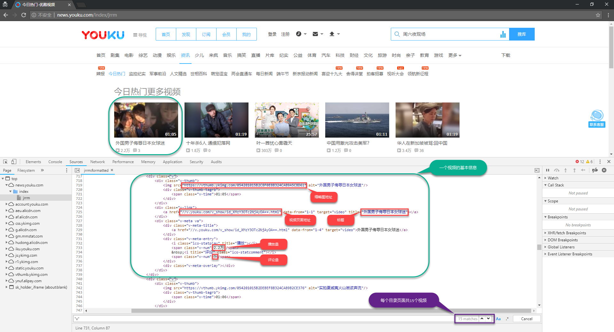
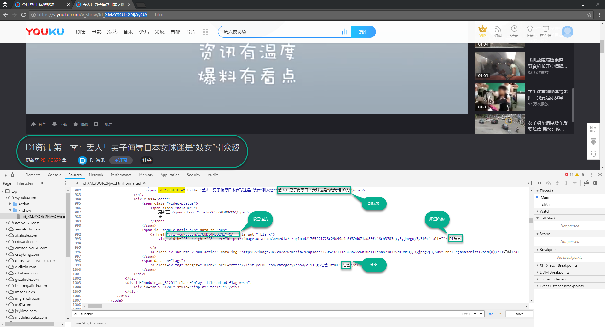
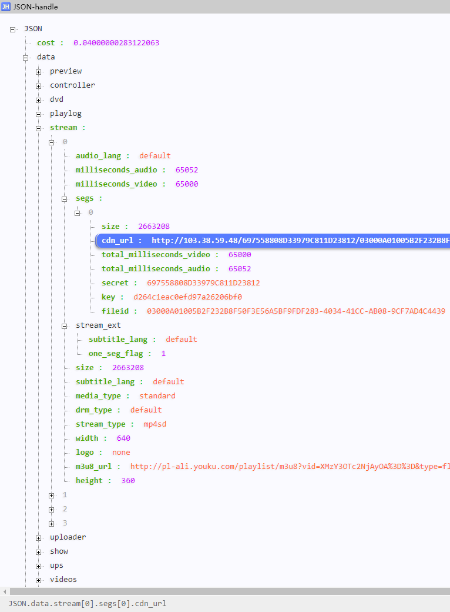
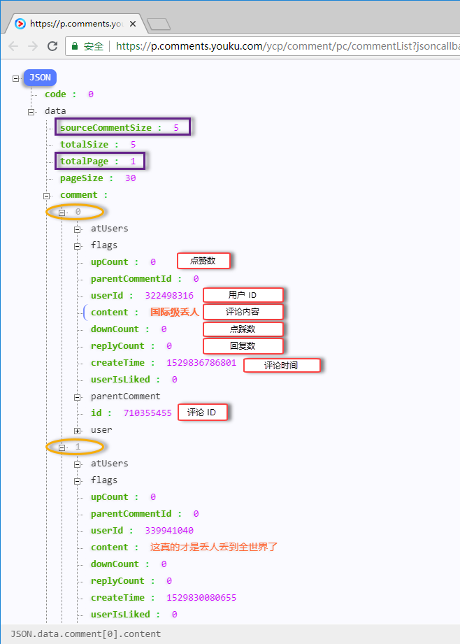
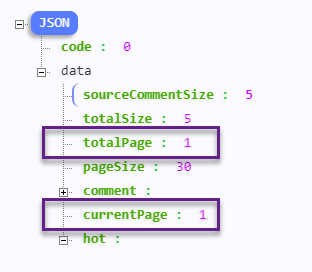
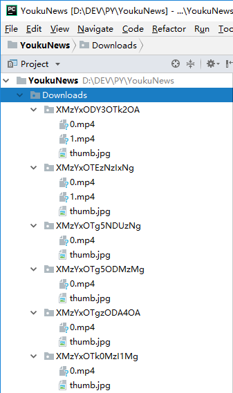
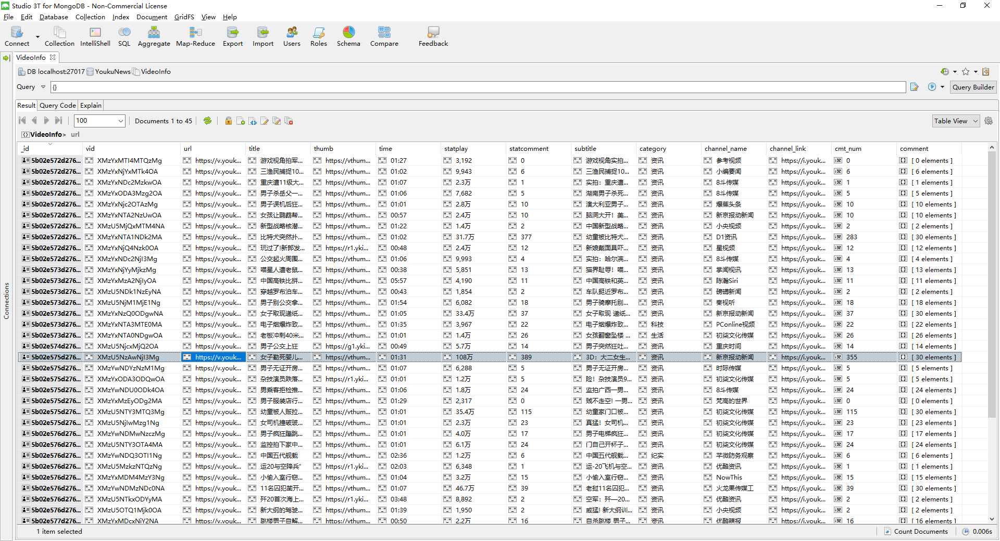

# 技术文档

## 快速索引

- [环境依赖](#环境依赖)

  - [语言](#语言)

  - [框架](#框架)

  - [其他](#其他)

- [系统架构](#系统架构)

  - [基本概念](#基本概念)

  - [数据流向](#数据流向)

- [数据结构](#数据结构)

  - [视频信息](#视频信息)

  - [评论信息](#评论信息)

- [信息解析](#信息解析)

  - [目录页面](#目录页面)

  - [视频页面](#视频页面)

  - [分段文件](#分段文件)

  - [评论列表](#评论列表)

- [数据输出](#数据输出)

  - [视频封面和分段文件](#视频封面和分段文件)

  - [视频信息输出至数据库](#视频信息输出至数据库)

- [已知问题](#已知问题)

  - [分段文件下载失败](#分段文件下载失败)

  - [频道链接获取失败](#频道链接获取失败)

## 环境依赖

### 语言: [Pyhton 3](https://docs.python.org/3/)

> 对于 Windows 平台, 建议在安装时勾选 `Add Python 3.x to PATH` , 或者[设置环境变量](https://docs.python.org/3/using/windows.html#setting-envvars)以通过命令行直接使用 Python.

### 框架: [Scrapy 1.5](https://doc.scrapy.org/en/1.5/)

> 对于 Windows 平台, 建议使用 [Anaconda](https://docs.anaconda.com/anaconda/) (或 [Miniconda](https://conda.io/docs/user-guide/install/index.html)) 的 `conda install -c conda-forge scrapy` 而不是 ~~`pip3 install`~~ ,  以避免可能出现的依赖问题.

### 其他

- `PyMongo` , 用于将视频信息写入 MongoDB 数据库;
- `Pillow` , 用于处理视频封面图片.

> 可通过 `pip3 install pymongo pillow` 安装这两个依赖.

## 系统架构

> 英文原文参见 Scrapy 官方文档的 [Architecture overview](https://doc.scrapy.org/en/1.5/topics/architecture.html)(架构概览) 章节.


*<center>图 1. Scrapy 架构概览及其数据流向</center>*

### 基本概念

> `图 1` 中蓝色方框

#### Requests and Responses

Scrapy 使用 `Requests`(请求) 与 `Responses`(响应) 爬取网站. 对网站发出特定的请求, 并将得到的响应返回, 从而实现数据的爬取.

> 参见本文档 [数据流向](#数据流向) 章节及官方文档 [Requests and Responses](https://doc.scrapy.org/en/1.5/topics/request-response.html) 章节.

#### Items

Sccrapy 提供 `Item` 类来结构化爬取到的数据. `Item` 提供了类字典([dict](https://docs.python.org/3/library/stdtypes.html#dict))的 API, 并且可以很方便的声明字段.

> 参见 本文档 [数据结构](#数据结构) 章节及官方文档 [Items](https://doc.scrapy.org/en/1.5/topics/items.html) 章节.

### 数据流向

Scrapy 中的数据流向(`图 1` 中红色箭头)由 Execution Engine(执行引擎) 控制, 如下所示:

1. Engine 从 Spider 获取要爬取的初始 Requests(请求).

2. Engine 在 Scheduler(调度器) 中安排请求, 并要求下一个要爬取的 Requests.

3. Scheduler 将下一个 Requests 返回给 Engine.

4. Engine 通过 Downloader Middlewares(下载器中间件) 将 Requests 发送到 Downloader(下载器).\
(参见 [`DownloaderMiddleware.process_request()`](https://doc.scrapy.org/en/1.5/topics/downloader-middleware.html#scrapy.downloadermiddlewares.DownloaderMiddleware.process_request))

5. 页面下载完毕, Downloader 生成一个该页面的 Response(响应)，并将其通过 Downloader Middlewares 发送给 Engine.\
(参见 [`DownloaderMiddleware.process_response()`](https://doc.scrapy.org/en/1.5/topics/downloader-middleware.html#scrapy.downloadermiddlewares.DownloaderMiddleware.process_response))

6. Engine 从 Downloader 收到 Response 并通过 Spider Middlewares(蜘蛛中间件) 发送给 Spider 进行处理.\
(参见 [`SpiderMiddleware.process_spider_input()`](https://doc.scrapy.org/en/1.5/topics/spider-middleware.html#scrapy.spidermiddlewares.SpiderMiddleware.process_spider_input))

7. Spider 对 Response 进行处理, 将爬取到的 [Item](#Items) 和需要跟进的新 Requests 返回给 Engine.\
(参见 [`SpiderMiddleware.process_spider_output()`](https://doc.scrapy.org/en/1.5/topics/spider-middleware.html#scrapy.spidermiddlewares.SpiderMiddleware.process_spider_output))

8. Engine 将爬取到的 Item 发送给 Item Pipelines, 然后将处理后的 Requests 发送给 Scheduler 并要求可能的下一个要爬取的 Requests.

9. 重复该流程(从第一步)直到 Scheduler 中没有更多的 Requests.

## 数据结构

爬取信息的数据结构在 [items.py](YoukuNews/items.py) 中定义.

### 视频信息

> `dict` in Python / `Document` in MongoDB

Key            | Type in Python   | Type in MongoDB     | 含义
:------------- | :--------------- | :------------------ | :-----------------------
`url`          | `str`            | `String`            | 页面链接
`vid`          | `str`            | `String`            | 唯一识别码
`time`         | `str`            | `String`            | 时长
`title`        | `str`            | `String`            | 标题
`subtitle`     | `str`            | `String`            | 副标题
`stat_play`    | `str`            | `String`            | 播放量
`stat_cmt`     | `str`            | `String`            | 评论量
`category`     | `str`            | `String`            | 分类
`channel_name` | `str`            | `String`            | 频道名称
`channel_link` | `str`            | `String`            | 频道链接
`comment_num`  | `int`            | `Int32`             | 评论数目
`comment_hot`  | `list` of `int`  | `Array` of `Int64`  | 热评ID列表
`comment_list` | `list` of `dict` | `Array` of `Object` | 所有评论列表(嵌套若干评论信息) 
`thumb_url`    | `str`            | `String`            | 缩略图下载链接
`thumb_path`   | `str`            | `String`            | 缩略图本地路径
`file_urls`    | `list` of `str`  | `Array` of `String` | 分段视频文件下载链接列表
`file_paths`   | `list` of `str`  | `Array` of `String` | 分段视频文件本地路径列表

### 评论信息

> `dict` in Python / `Object` in MongoDB

Key         | Type in Python | Type in MongoDB | 含义
:---------- | :------------- | :-------------- | :---------
`id`        | `int`          | `Int64`         | 唯一识别码
`time`      | `int`          | `Int64`         | 发布时间戳
`user`      | `int`          | `Int32`         | 发布用户ID
`num_up`    | `int`          | `Int32`         | 点赞数
`num_down`  | `int`          | `Int32`         | 点踩数
`num_reply` | `int`          | `Int32`         | 回复数
`content`   | `str`          | `String`        | 评论内容

## 信息解析

信息解析规则及具体处理在 [spider.py](YoukuNews/spiders/spider.py) 中定义.

### 目录页面

优酷资讯频道目录页面的解析在 `parse_basic()` 中定义, 规则如下图以"今日热门"目录页面为例.



*<center>图 2. 目录页面解析规则示例</center>*

#### 目录翻页

如 `图 2` 中所示, 每个目录页面共15个视频, 通过递归调用 `parse_basic()` 继续解析下一页的链接实现向下翻页.


*<center>图 3. 目录页面翻页示例</center>*

### 视频页面

优酷资讯频道视频页面的解析在 `parse_detail()` 中定义, 规则如下图以 `图 2` 中的视频页面为例.



*<center>图 4. 视频页面解析规则示例</center>*

### 分段文件

每个视频对应的分段文件下载链接列表 `file_urls` 从优酷的 UPS 接口解析获取, 详见 `parse_file()`.

#### UPS 接口链接

以上文的视频为例, 优酷的 UPS 链接格式如下:

```
https://ups.youku.com/ups/get.json?callback=json&vid=XMzY3OTc2NjAyOA&ccode=0503&client_ip=192.168.1.1&client_ts=1527072900&utid=OMofE8kM4gMCARueFdD7Bexs&ckey=DIl58SLFxFNndSV1GFNnMQVYkx1PP5tKe1siZu%2F86PR1u%2FWh1Ptd%2BWOZsHHWxysSfAOhNJpdVWsdVJNsfJ8Sxd8WKVvNfAS8aS8fAOzYARzPyPc3JvtnPHjTdKfESTdnuTW6ZPvk2pNDh4uFzotgdMEFkzQ5wZVXl2Pf1%2FY6hLK0OnCNxBj3%2Bnb0v72gZ6b0td%2BWOZsHHWxysSo%2F0y9D2K42SaB8Y%2F%2BaD2K42SaB8Y%2F%2BahU%2BWOZsHcrxysooUeND
```

> 直接访问该链接将会返回错误, 提示"客户端无权播放", 详见后文.

#### 查询参数

| 参数名称    | 参数含义              | 填入内容                                                    |
| ----------- | --------------------- | ----------------------------------------------------------- |
| `callback`  | 回调函数              | `json`                                                      |
| `vid`       | 视频唯一识别码        | 视频信息中的`vid`                                           |
| `ccode`     | 客户端类型代码        | 根据优酷封锁情况不同需要调整, 如 `0502`, `0503`, `0510` 等. |
| `client_ip` | 客户端 IP             | `192.168.1.1`                                               |
| `client_ts` | 客户端时间戳          | 并未受限, 可填入任意时间, 如 `1527072900`.                  |
| `utid`      | Cookies 中的 CNA 验证 | 应未受限, 可填入任意有效值, 如 `OMofE8kM4gMCARueFdD7Bexs`.  |
| `ckey`      | 加密验证密钥          | 很难破解, 但可填入任意有效值, 共 240 字符.                  |

#### 请求参数

在调试过程中发现, 即使查询参数均已填写, 仍然得到错误的返回数据. 结论是还需要在向 UPS 接口发送请求时加上请求参数 `Referer` 和 `P_sck`. 调试日志参见下面的 `图 5` 和 `图 6`.


*<center>图 5. 无请求参数访问 UPS 接口示例</center>*

> 如上图所示, 无请求参数访问时, UPS 接口返回错误提示"客户端无权播放".

---


*<center>图 6. 带请求参数访问 UPS 接口示例</center>*

> 如上图所示, 当带有上文两个请求参数访问时, UPS 接口返回正确数据.

#### 下载地址解析

在上文中的请求参数和查询参数均通过验证后, 我们可以从 UPS 接口获取到正确的返回数据, 其中包含视频对应的分段文件的真实下载地址.

结合 `图 6` 我们可以看到, 返回数据整体由 `json()` 包括其中. 故只需将 Response 文本稍加处理(截取最外层一对圆括号中的字符串), 便能的到其中的 JSON 结构数据, 然后通过 `json.loads` 将其解码为 Python 的 `dict` 对象进行解析.



*<center>图 7. UPS 接口返回的流媒体分段文件下载地址</center>*

### 评论列表

每个视频对应的所有评论列表 `comment_list` 从优酷的评论接口解析获取, 详见 `parse_comment()`.

#### 评论接口链接

仍以上文中 `vid` 为 `XMzY3OTc2NjAyOA` 的视频为例, 优酷评论接口链接格式如下:

> 与 UPS 接口的严格验证不同, 评论接口的验证相对宽松, 各查询参数使用固定值即可返回正确数据.

```
https://p.comments.youku.com/ycp/comment/pc/commentList?jsoncallback=n_commentList&app=100-DDwODVkv&objectId=XMzY3OTc2NjAyOA&objectType=1&listType=0&currentPage=1&pageSize=30&sign=df030fad8c097139f7fd726e85f63339&time=1526430304
```

其中: 
- `objectId` 对应每个视频信息中的 `vid` ;
- `currentPage` 是当前访问的接口链接是总页数中的第几页(总页数在返回的数据中, 见后文);
- 其他参数均采用固定值, 经测试并未受限.

#### 评论信息解析



*<center>图 8. 评论接口返回的评论信息</center>*

如图所示, 评论接口返回数据是 JSON 结构, 同样通过 `json.loads` 解码为 `dict` 对象进行解析. 

#### 评论接口翻页

评论接口翻页方式与前文中的目录页面翻页相比更简单, 只需获取当前页码 `currentPage` 和



*<center>图 9. 评论接口翻页</center>*

## 数据输出

爬取到的所有数据的输出均在 [pipelines.py](YoukuNews/pipelines.py) 中定义, 另有一部分配置写在 [settings.py](https://github.com/liolok/YoukuNews/blob/master/YoukuNews/settings.py) 中.

### 视频封面和分段文件

封面图片和分段文件通过 Scrapy 的 `MediaPipeline` 进行下载, 详见官方文档的 [Downloading and processing files and images](https://doc.scrapy.org/en/1.5/topics/media-pipeline.html)(下载和处理文件及图片) 章节.

#### 自定义下载路径及命名

`MediaPipline` 默认的保存路径即为 `settings.py` 中配置的 `FILES_STORE` 及 `IMAGES_STORE`, 并以下载 URL 的 SHA1 哈希值命名. 为了让后续的文件访问更方便, 我们自 `ImagesPipeline` 和 `FilesPipeline` 继承自定义的 Pipeline, 并在其中重写 `file_path()` 函数, 以 `vid` 作为路径保存文件. 下载结果示例见下图.



*<center>图 10. 下载目录结构及文件命名</center>*

> 大部分资讯视频因为时长较短, 只有一个分段文件即 `0.mp4`.

### 视频信息输出至数据库

视频信息(详见 [数据结构](#数据结构) 章节)的输出参见官方文档的 [Write items to MongoDB](https://doc.scrapy.org/en/1.5/topics/item-pipeline.html#write-items-to-mongodb)(将 Items 写入 MongoDB) 章节.



*<center>图 11. 存储在 MongoDB 数据库中的视频信息</center>*

## 已知问题

### 分段文件下载失败

在测试"今日热门"分类目录共 67 页(1005个视频)的视频分段文件时, 得到 9 个 `302` 错误码和 8 个 `502` 错误码, 详见日志摘要.

```bash
...
2018-06-05 21:16:36 [scrapy.core.engine] DEBUG: Crawled (302) <GET http://221.181.201.136/67741E3E50A398292ED16764B8/03000A01005AC60F68EACED38C66A9F5679B70-511D-44B6-A9FC-95535173BC24.mp4?ccode=0503&duration=201&expire=18000&psid=5bc947f4478922eeb6de722ca03ea779&sp=&ups_client_netip=700a837f&ups_ts=1528204591&ups_userid=&utid=OMofE8kM4gMCARueFdD7Bexs&vid=XMzUxNjY5NTY0MA%3D%3D&vkey=Bf17dfeb5da15a36d1e4076728aa78cf7> (referer: None) ['partial']
2018-06-05 21:16:36 [scrapy.pipelines.files] WARNING: File (code: 302): Error downloading file from <GET http://221.181.201.136/67741E3E50A398292ED16764B8/03000A01005AC60F68EACED38C66A9F5679B70-511D-44B6-A9FC-95535173BC24.mp4?ccode=0503&duration=201&expire=18000&psid=5bc947f4478922eeb6de722ca03ea779&sp=&ups_client_netip=700a837f&ups_ts=1528204591&ups_userid=&utid=OMofE8kM4gMCARueFdD7Bexs&vid=XMzUxNjY5NTY0MA%3D%3D&vkey=Bf17dfeb5da15a36d1e4076728aa78cf7> referred in <None>
...
2018-06-05 21:12:01 [scrapy.core.engine] DEBUG: Crawled (502) <GET http://111.1.52.137/69752A10D023671972D603D52/03000A01005AD57C7D5C0E635A5E98067A1EFD-DCA0-9BDC-A0A2-F6653C38A65D.mp4?ccode=0503&duration=67&expire=18000&psid=88f75bd75942d75739e26449c37ee038&sp=&ups_client_netip=700a837f&ups_ts=1528204291&ups_userid=&utid=OMofE8kM4gMCARueFdD7Bexs&vid=XMzU0MjM4ODA1Ng%3D%3D&vkey=Bb468251f743c94b8e538ac4fbb2b4c04&s=efbfbdda9837efbfbdef> (referer: None)
2018-06-05 21:12:01 [scrapy.pipelines.files] WARNING: File (code: 502): Error downloading file from <GET http://111.1.52.137/69752A10D023671972D603D52/03000A01005AD57C7D5C0E635A5E98067A1EFD-DCA0-9BDC-A0A2-F6653C38A65D.mp4?ccode=0503&duration=67&expire=18000&psid=88f75bd75942d75739e26449c37ee038&sp=&ups_client_netip=700a837f&ups_ts=1528204291&ups_userid=&utid=OMofE8kM4gMCARueFdD7Bexs&vid=XMzU0MjM4ODA1Ng%3D%3D&vkey=Bb468251f743c94b8e538ac4fbb2b4c04&s=efbfbdda9837efbfbdef> referred in <None>
...
'downloader/response_status_count/302': 9,
'downloader/response_status_count/502': 8,
'file_count': 2061,
'file_status_count/downloaded': 2061,
...
```

> 上面的 2061 个下载成功的文件中, 应有 1005 个是视频封面, 其余的 1056 个是下载成功的分段文件, 另外 17 个则是由于 `302` 和`502` 错误码下载失败的分段文件.

### 频道链接获取失败

```bash
...
2018-06-05 21:15:19 [scrapy.core.scraper] ERROR: Spider error processing <GET https://v.youku.com/v_show/id_XMzM5ODg0MjQ0OA> (referer: https://news.youku.com/index/jrrm/_page225659_41_cmodid_225659)
Traceback (most recent call last):
  File "c:\dev\python\python36\lib\site-packages\scrapy\utils\defer.py", line 102, in iter_errback
    yield next(it)
  File "c:\dev\python\python36\lib\site-packages\scrapy\spidermiddlewares\offsite.py", line 30, in process_spider_output
    for x in result:
  File "c:\dev\python\python36\lib\site-packages\scrapy\spidermiddlewares\referer.py", line 339, in <genexpr>
    return (_set_referer(r) for r in result or ())
  File "c:\dev\python\python36\lib\site-packages\scrapy\spidermiddlewares\urllength.py", line 37, in <genexpr>
    return (r for r in result or () if _filter(r))
  File "c:\dev\python\python36\lib\site-packages\scrapy\spidermiddlewares\depth.py", line 58, in <genexpr>
    return (r for r in result or () if _filter(r))
  File "D:\DEV\PY\YoukuNews\YoukuNews\spiders\spider.py", line 54, in parse_detail
    video['channel_link'] += channel.xpath('./@href').re_first(r'//i.youku.com/i/[A-Za-z0-9]+')
TypeError: must be str, not NoneType
...
'spider_exceptions/TypeError': 1,
...
```

> 该错误经测试发现在 1005 个视频的批量爬取中随机复现, 频度大概在 1~3 次左右. 且在随后针对出错的视频信息单独的手动调试中并未复现.
